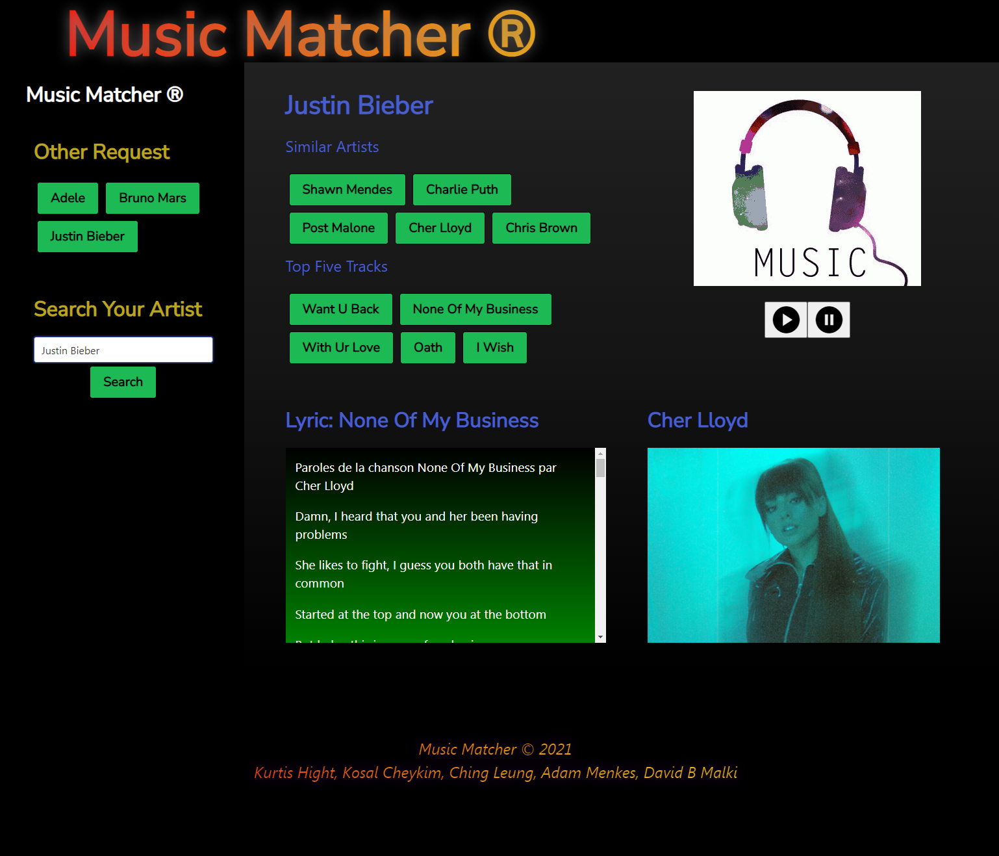

# MusicMatcher
Music Matcher is a web application that allows user to search for a music artist that generates five similar artists. Once, a similar artist is selected, the page will generate five top tracks of the selected artist. The lyric of that track will appear along with a player to play a snippet of that selected track. There is a play and pause button for user to choose when they want to play or stop the music. Music Matcher will also generate five other requested artists on the right side. Enjoy finding similar artists that you have not discovered them yet. Least but last, sing along...

## User Story
As a user, when I load the page.
Then I will see 0-5 other artist request list.
Then I can search for an artist.
When I searched for an artist.
Then I get up to 5 similar artists.
When I click on one of the artists.
Then I get the Top 5 Tracks of the artist.
When I click on the track.
Then I can see the lyrics and can play/pause the song snippet.

## Built With
* HTML
* CSS
* Bulma
* JavaScript
* API

## HTML
* The main index page to display the basic structure of Music Matcher.

## CSS/Bulma
* Custom and open source styling for Music Matcher which display differnt colors, font-size and display size on different screens.
* Bulma is able to do the flex wrap which saves a lot of work from flex wrapping from CSS.

## JavaScript
* Activating the click function for users to search artist from the page.
* Fetch data from API and return JSON parsed data.
* Dynamically generate elements when search button is triggered.
* Dynamically generate up to 5 button elements as similar artists.
* Dynamically generate up to 5 button elements as top 5 tracks of the artist.
* Store recent search to local storage.

## API Researched
* Spotify
* Youtube
* Shazam
* MusicBrainz
* LastFM
* Musixmatch
* Giphy

## API Used
* Napster
* Lyrics.ovh
* Tenor

## Challenges
* We went into problem with CORS and Tokens for APIs.
* Audio are only available for 30 seconds.
* Some lyrics are not available due to free resource limitation. Many apis requires a paid subscription.
* Functions get complicated and bugs occur when we created half of the elements dynamically.
* Bulma CSS has a lot of in-line styling which took some time to figure out overwriting the style with !important.

## After thought
In our future project, we may try not to add music streaming feature because there were a lot of issues with tokens, apikeys and cors. We also have an unexpected bulk data returned from lyrics api and we have to create a bunch of replacement string to get rid of the extra syntax that comes with the fetch. We tried to make at least half of our elements dynamically instead of directly adding them on html so it looks more special and technical but it took us more time to debug the function but indeed more fancy as well. Modifying the CSS makes a lot of conflicts since it was done by 2 person and there is a mix of custom CSS and Bulma default CSS which means flex has to be speficied if any elements are added after. Last but not least, this project is too small for a group of 5 to work on and dealing with distribution of duties.

## Website
https://mockcomic.github.io/MusicMatcher

## Image of Website

